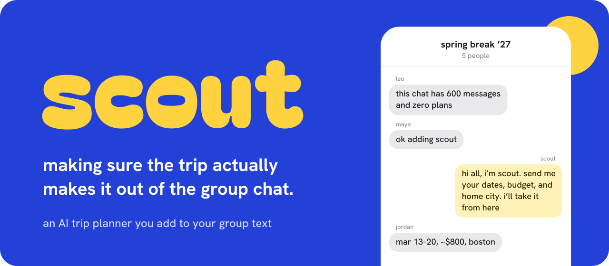

<p align="center">
  
</p>

# scout

**trips that make it out of the group chat.**

hi, i'm scout.

you know the thread. someone says "we should go somewhere," everyone hearts it, and six hundred messages later nobody has booked a thing. add me to that chat and i'll get you from "we should go somewhere" to an actual trip.

here's how it goes:

1. **add me.** put my number or Apple ID in the group text. no app, no accounts, nobody signs up for anything.
2. **tell me what you want.** everyone sends their dates, budget, home city, and one must-have. i confirm each one so you can catch my mistakes, and i keep track of who hasn't answered yet.
3. **i pitch three places.** once i know where your dates overlap, i suggest three destinations that fit everyone's budget and must-haves.
4. **you vote.** reply "2" or "tulum" and i count it. i announce the winner and send a link that puts the trip on your Google Calendar.
5. **i plan the days.** ask for a plan and i'll send a day-by-day itinerary, plus Google Flights links from each person's home city and an Airbnb search for the group.
6. **we settle up.** tell me what you paid ("i got the airbnb, $1,240") or text me a photo of the receipt. i split it, work out the fewest payments to square everyone up, and pay people back in sandbox money, so nothing real moves.

i never book anything or touch real money. i find the links, you book. and i stay quiet unless you tag me or tell me something about the trip, because a scout that talks too much gets kicked out of the chat.

**where i'm at:** joining, collecting preferences, and running the vote all work (phase 1). phase 2 so far has the itinerary, booking links, the calendar link, and cost splitting. on-trip recommendations and a shared photo album are next. the full plan lives in [scout-PRD.md](scout-PRD.md).

## How it fits together

```
iMessage ⇄ Photon (spectrum-ts) ⇄ bridge/  ──HTTP──▶  src/scout/  ⇄ Claude API
         ⇄ or a Linq line       ⇄ TypeScript          Python         + SQLite
                                                                     + Nessie
```

Photon only sends messages from TypeScript, so `bridge/` is a thin relay. Everything I know and decide lives in the Python service:

| File | What it does |
| --- | --- |
| `conversation.py` | Decides what happens with each message: introduce scout, count a vote, ask the agent, or stay quiet. |
| `agent.py` | Shows Claude the trip and the recent chat, then runs the tools Claude picks. |
| `system_prompt.md` | scout's instructions: when to speak, how to text, the planning flow. |
| `agent_tools.py` | The tools Claude can call, and how each call maps onto a trip action. |
| `trip_actions.py` | The changes scout can make to a trip (save preferences, post a poll, record a vote). |
| `group_summary.py` | Date overlap, budget range, and who hasn't replied. |
| `polls.py` | Reading "2" or "tulum" as a vote, and picking the winner. |
| `itinerary.py` | How the day-by-day plan reads in the chat. |
| `booking_links.py` | Google Flights links from each home city and an Airbnb link for the group. |
| `calendar_link.py` | The "Add to Google Calendar" link sent once the trip is locked in. |
| `money.py` | How amounts of money read in the chat. |
| `settle_up.py` | Who owes whom: each person's share and the fewest payments to settle up. |
| `nessie.py` | Paying members back with sandbox money over Capital One's Nessie API. |
| `trip_store.py` | Saving everything to SQLite. |
| `simulate.py` | A fake group chat in your terminal for testing without phones. |

## Setup

You need [uv](https://docs.astral.sh/uv/), [Bun](https://bun.sh), and an Anthropic API key.

```sh
uv sync
cd bridge && bun install && cd ..
export ANTHROPIC_API_KEY=sk-ant-...
export NESSIE_API_KEY=...   # optional; without it, payments are simulated
```

Settling up pays members back over [Nessie](https://api.nessieisreal.com), Capital One's sandbox bank, so no real money moves. I open a Nessie account for each member on their first payment. If `NESSIE_API_KEY` isn't set, or Nessie is down, I still record the payment and say in the chat that it was simulated.

There are no database migrations yet. After pulling a change to the database layout, delete your local `scout.db`.

## Take me for a spin (no phones needed)

Run a whole group chat in your terminal, playing every person yourself:

```sh
uv run scout-simulate maya leo jordan priya
> maya: hey @scout, spring break?
> maya: i'm maya, free mar 13-20, ~$800, flying from boston, need a beach
> leo: leo here, mar 14-22, 600, nyc
...
> leo: 2
> leo: fyi I paid the airbnb, $1,240
> jordan: @scout who owes what
> jordan: @scout pay leo
```

Add `--verbose` to see each tool I call.

## Put me in a real group chat

1. Start the Python service: `uv run scout-server` (listens on `127.0.0.1:8787`).
2. Create `bridge/.env` with one of these:
   - Local mode, which runs on this Mac's Messages account. It needs Full Disk Access for your terminal, and no Photon plan. See [scout-imessage-groups.md](scout-imessage-groups.md).
     ```
     IMESSAGE_MODE=local
     ```
   - A Photon cloud line:
     ```
     IMESSAGE_MODE=cloud
     PHOTON_PROJECT_ID=...
     PHOTON_PROJECT_SECRET=...
     ```
   - A Linq line, which needs no Apple ID. Get a free line and key with `npm i -g @linqapp/cli && linq signup`.
     ```
     IMESSAGE_MODE=linq
     LINQ_API_KEY=...
     ```
3. Start the bridge: `cd bridge && bun start`.
   - In Linq mode, also run `linq webhooks listen --forward-to http://127.0.0.1:8788/linq-events` in another terminal. It relays Linq's events to the bridge.
4. Add my number or Apple ID to a group text and say hi.
   - On Linq's free line, everyone in the group texts my number privately first (`linq contacts add` each of them, up to 20). I ignore those private texts.

## Development

```sh
uv run pytest                  # tests
uv run ruff check src tests    # lint
uv run ruff format src tests   # format
cd bridge && bun test          # bridge tests
cd bridge && bun run typecheck # type-check the bridge
```
