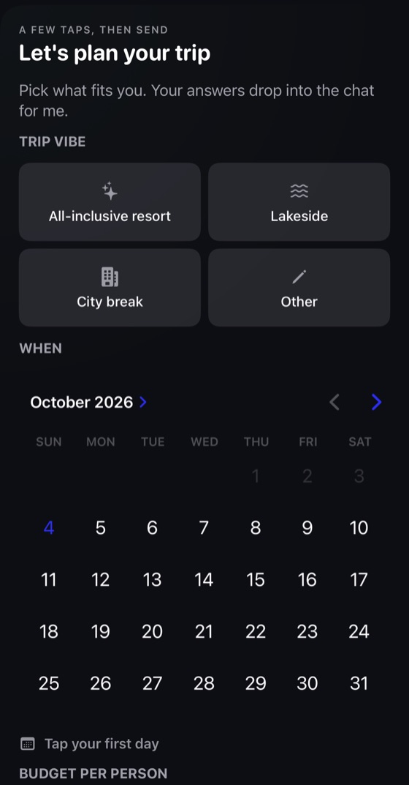
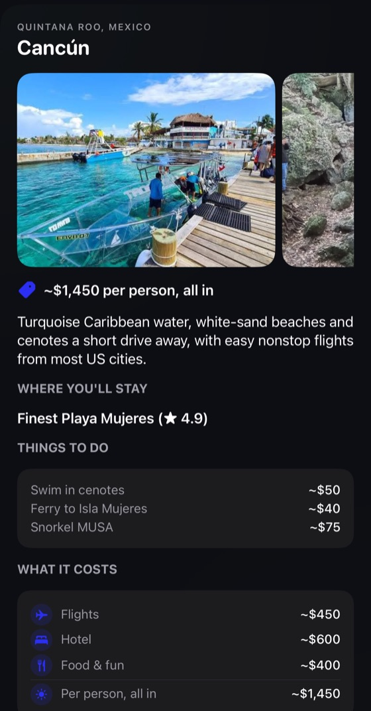
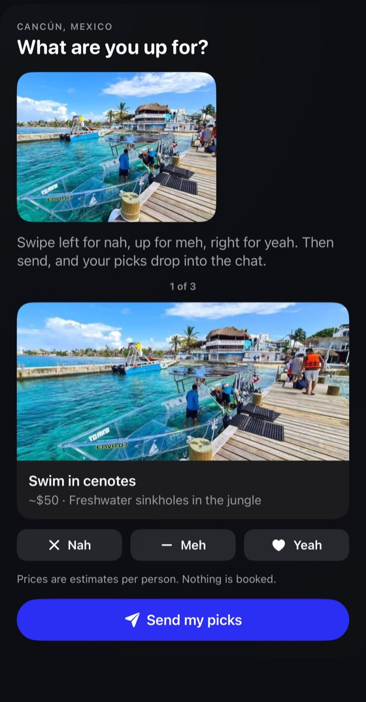

<p align="center">
  
</p>

<p align="center">
  
</p>

# scout

**trips that make it out of the group chat.**

**[getscout.me](https://getscout.me)** · [devpost](https://devpost.com/software/scout-pifctu) · built at BigRed//Hacks 2026

hi, i'm scout.

you know the thread. someone says "we should go somewhere," everyone hearts it, and six hundred messages later nobody has booked a thing. add me to that chat and i'll get you from "we should go somewhere" to an actual trip.

here's how it goes:

1. **add me.** first, everyone texts me privately once: my line can't join a group with anyone who hasn't. i'll ask what to call you (answering is optional, but i'll remember your name for every group we're in). then put my number in the group text. no accounts, nobody signs up for anything. i say hi once, tell you what you're getting, and drop a trip card in the chat.
2. **tell me what you want.** everyone taps through the card (takes like 30 seconds): the kind of trip, when you're free, your budget, where you're flying from, and what you're into. or just text it, or tell me a friend's ("leo's flying from nyc too"). i 👍 what you tell me about yourself, confirm what you tell me about someone else so they can catch my mistakes, and while i wait i'll tell you how many of you are in and where the group is leaning.
3. **i pitch three places.** i don't wait on everyone: once most of you have shared and your dates overlap, i look up the best-rated spots that fit and send three brochures you can tap through: photos, the best hotel there, three things to do, and what the trip runs per person. tell me your final decision ("@scout we're going with cancun") and i'll lock it in. want to vote instead? ask, and i'll post a numbered poll you answer with "2" or a 👍.
4. **you tell me what you'd actually do.** i send a deck of things to do there, each with a picture and a price. rate each one nah, meh or yeah and hit send. once most of you have sent picks, i move on.
5. **i plan the days.** a day-by-day plan built from what more than one of you is in for, paced for whether you're up at six or noon, with the one-person picks offered as add-ons. it comes with a calendar link to subscribe to, so every event lands in your calendar and stays up to date if the plan changes.
6. **i find the flights and the room.** ask and i'll send the best round trip from each of your home cities and the top hotel for your dates, with live prices and a link to book.
7. **i help on the trip.** ask for a "cozy taco spot, not touristy, near our airbnb" and i'll send three real places nearby. pick one and i'll send directions.
8. **we settle up.** tell me what you paid ("i got the airbnb, $1,240"), even if only some of you shared it, or text me a photo of the receipt and i'll check the total with you first. i split it, work out the fewest payments to square everyone up, check each one off when you tell me you've paid ("i paid leo"), and send the full breakdown at the end.

i never book anything or touch real money. i find the links, you book. and i stay quiet unless you tag me, answer me, or say something i can actually help with, because a scout that talks too much gets kicked out of the chat. photos and voice notes work too: i read what's in them.

**where i'm at:** everything above is built. the cards (trip card, brochures, activity deck, itinerary, flights, hotel and the expense report) are drawn right inside iMessage by [HermesShare](https://github.com/time-attack/HermesShare), an iMessage extension, so for now everyone needs our build of it on their phone to see them; without it, every card falls back to plain text. how the cards work lives in [integration.md](integration.md). the brochures need a Google Places key. without the other optional keys i fall back to plain text: a numbered list for the activity deck, the plan as text, and search links instead of live flights and hotels. a shared photo album and message effects (confetti) are still to come. the full plan lives in [scout-PRD.md](scout-PRD.md). want in? join the waitlist at [getscout.me](https://getscout.me).

## What it looks like

<p align="center">
  
  &nbsp;
  
  &nbsp;
  
</p>

<p align="center"><sub>the trip card everyone fills out · a destination brochure · the activity deck you rate</sub></p>

## How it fits together

```
iMessage ⇄ Linq line (groups) ⇄ bridge/: Photon's spectrum-ts ──HTTP──▶ src/scout/ ⇄ Claude API
                                 TypeScript                             Python      + SQLite
```

My number is a [Linq](https://linqapp.com) line, a real iMessage number you can add to a group. Photon's cheaper plans can't join groups, so Linq gets me in, as a custom platform in Photon's Spectrum SDK, so every message goes through Photon ([scout-imessage-groups.md](scout-imessage-groups.md)). Photon only sends messages from TypeScript, so `bridge/` is a thin relay. Everything I know and decide lives in the Python service:

| File | What it does |
| --- | --- |
| `app.py` | The HTTP endpoints the bridge calls with each message and tapback, and the calendar feeds. |
| `conversation.py` | Decides what happens with each message: count a vote or activity picks, ask the agent when someone tags @scout, or check with the speak gate first. |
| `speak_gate.py` | A quick, cheap check of whether a message that doesn't tag scout is worth answering (`speak_gate_prompt.md`). |
| `private_chat.py` | The one-on-one text each member sends first: scout asks their name and points them to a group. |
| `agent.py` | Shows Claude the trip and the whole chat, then runs the tools Claude picks. |
| `openai_agent.py` | The same agent on OpenAI, for when only an OpenAI key is set (`ai_provider.py` picks). |
| `system_prompt.md` | scout's instructions: when to speak, how to text, the planning flow. |
| `agent_tools.py` | The tools Claude can call, and how each call maps onto a trip action. |
| `trip_actions.py` | The changes scout can make to a trip (save preferences, send a card, record a vote, log an expense). |
| `trip.py` | The trip a group is planning, and the people planning it. |
| `outgoing.py` | What scout sends: texts, tapbacks, link cards and interactive cards. |
| `cards.py` | The HermesShare cards: trip card, brochures, activity deck, itinerary, flights, hotel and expense report. |
| `group_summary.py` | Date overlap, budget range, and who hasn't replied. |
| `brochures.py` | The three destination pitches, filled in with real hotels and photos from Google Places. |
| `polls.py` | Reading "2" or "tulum" as a vote, and picking the winner. |
| `activity_deck.py` | The things to do at the destination, and reading each member's nah, meh or yeah. |
| `itinerary.py` | How the day-by-day plan reads in the chat. |
| `calendar_feed.py` | The subscribable calendar feed of the itinerary, and the link to it sent when the first plan is posted. |
| `flights.py` | Live Google Flights search through SerpApi. |
| `best_flights.py` | The best flight from each home city, and how it reads in the chat. |
| `hotels.py` | Live Google Hotels search through SerpApi. |
| `best_hotel.py` | The hotel scout recommends for the trip, and how it reads in the chat. |
| `serpapi.py` | The request that the flight and hotel searches share. |
| `booking_links.py` | Google Flights links from each home city and an Airbnb link for the group, for when live search isn't set up. |
| `places.py` | Real places and photos from Google Places. |
| `nearby.py` | How nearby suggestions and directions read in the chat. |
| `outside_services.py` | The outside APIs scout uses beyond Claude, connected when their keys are set. |
| `media.py` | Keeping the photos and voice notes members send. |
| `openai_transcriber.py` | Putting those photos and voice notes into words. |
| `money.py` | How amounts of money read in the chat. |
| `expense_split.py` | How one expense divides between the people who shared it, to the cent. |
| `settle_up.py` | Who owes whom: each person's share and the fewest payments to settle up. |
| `expense_report.py` | The end-of-trip breakdown of who paid what. |
| `trip_store.py` | Saving everything to SQLite. |
| `trip_seeds.py` and `dev_endpoints.py` | Starting a trip partway through, for testing. |
| `simulate.py` | A fake group chat in your terminal for testing without phones. |

## Setup

You need [uv](https://docs.astral.sh/uv/), [Bun](https://bun.sh), and an Anthropic API key.

```sh
uv sync
cd bridge && bun install && cd ..
cp .env.example .env   # then add your ANTHROPIC_API_KEY
```

Everything else in `.env` is optional, and [.env.example](.env.example) says what each key turns on:

- `OPENAI_API_KEY` reads the photos and voice notes people send. Without an Anthropic key, I run on OpenAI instead.
- `GOOGLE_PLACES_API_KEY` finds the real hotels and photos for the brochures and cards, and places to go on the trip.
- `SERPAPI_API_KEY` gets live flight fares and hotel rates.
- `SCOUT_PUBLIC_URL` is where calendar apps reach me for the itinerary's calendar link.

There are no database migrations yet. After pulling a change to the database layout, delete your local `scout.db`.

## Take me for a spin (no phones needed)

Run a whole group chat in your terminal, playing every person yourself:

```sh
uv run --env-file .env scout-simulate maya leo jordan priya
> maya: hey @scout, spring break?
> maya: i'm maya, free mar 13-20, ~$800, flying from boston, need a beach
> leo: leo here, mar 14-22, 600, nyc
...
> leo: we're going with san juan
> leo: fyi I paid the airbnb, $1,240
> jordan: @scout who owes what
> jordan: @scout I paid leo
```

Add `--verbose` to see each tool I call.

## Put me in a real group chat

1. Start the Python service: `uv run --env-file .env scout-server` (listens on `127.0.0.1:8787`).
2. Create `bridge/.env` (start from [bridge/.env.example](bridge/.env.example)) with one of these:
   - A Linq line, for group chats. Each teammate gets their own free line and key with `npm i -g @linqapp/cli && linq signup`. See [scout-imessage-groups.md](scout-imessage-groups.md).
     ```
     IMESSAGE_MODE=linq
     LINQ_API_KEY=...
     ```
   - A Photon cloud line, for one-on-one chats:
     ```
     IMESSAGE_MODE=cloud
     PHOTON_PROJECT_ID=...
     PHOTON_PROJECT_SECRET=...
     ```
   - Local mode, which runs on this Mac's Messages account. It needs an Apple ID signed into Messages and Full Disk Access for your terminal.
     ```
     IMESSAGE_MODE=local
     ```
3. Start the bridge: `cd bridge && bun start`.
   - In Linq mode, also run `linq webhooks listen --forward-to http://127.0.0.1:8788/linq-events` in another terminal. It relays Linq's events to the bridge.
   - Or start the service, the bridge and the relay together with `cd bridge && bun run dev`.
4. Add each person who'll be in the group, one at a time:
   1. Add them to the line with `linq contacts add +1...` (the free line takes up to 20) and send them the link it gives you.
   2. They text my number privately. I ask what to call them; answering is optional, and I remember the name for every group they're in.
   3. Only after that first text can they be in a group with me.
5. Make sure everyone has our build of [HermesShare](https://github.com/time-attack/HermesShare) on their phone, or they'll see every card as plain text.
6. Add my number to the group text (on an iPhone in the group, tap its name, then **Add Member**) and say hi.

## Development

[DEVELOPING.md](DEVELOPING.md) covers testing a change without phones, running me in a real group, and setting up the demo group. It's written for teammates and their coding agents.

```sh
uv run pytest                  # tests
uv run ruff check src tests    # lint
uv run ruff format src tests   # format
cd bridge && bun test          # bridge tests
cd bridge && bun run dev       # service, bridge and Linq relay in one terminal
cd bridge && bun run devchat   # play a group chat through the bridge, no phones
cd bridge && bun run e2e       # end-to-end journeys (needs ANTHROPIC_API_KEY)
cd bridge && bun run typecheck # type-check the bridge
```

The landing page at [getscout.me](https://getscout.me) lives in `landing/` and is hosted on Netlify. [landing/README.md](landing/README.md) covers running and changing it.
